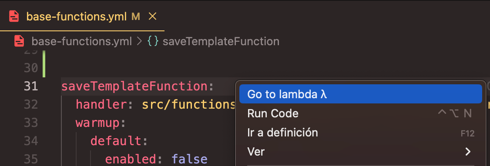
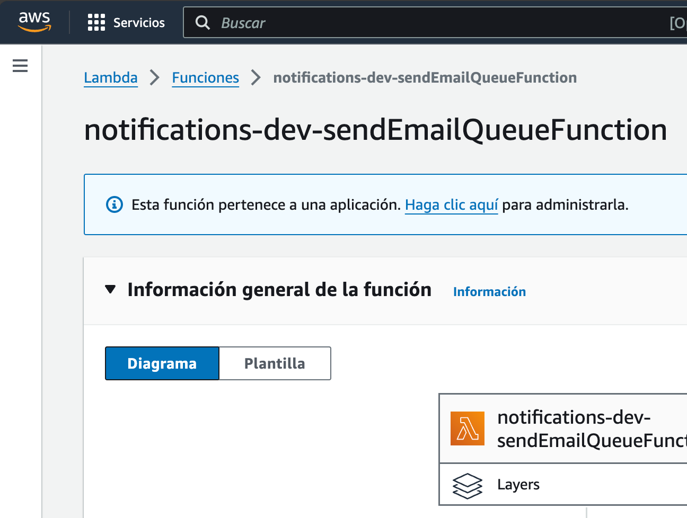
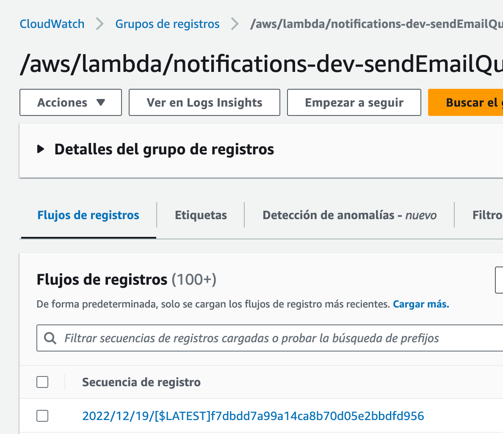

# DD360 Handler shortcuts

Simple VS code extension to open AWS Console links of Lambda & Cloudwatch dashboards directly from lambda Yaml declarations of serverless framework.

## Features

This extension let you right click a lambda delcaration on Yaml file, then open the AWS dashboards in the default web browser:

##### 1. Right click on lambda name:

##### 2. Automatically opens both Lambda & Cloudwatch:

  

#### Considerations

This functionality supports search the `serverless.yml` config across:

- Simple project workspace
- Multiple workspaces
- Mono-repo arquitecture with simple or multiple workspaces

Only works on `Yaml` based serverless configuration. For now does not work with Typescript serverless declarations.

## Extension Settings

Coming soon 🚧 For now, we have static deafult `STAGE` & `REGION` config

## Release Notes

### 0.0.1

Initial release with basic features.
